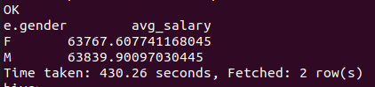

# Hadoop_Simple
1. **Hadoop**-related **Basic Knowledge**
2. **Word Counting** Project
3. Using Hadoop with **Hive**

## Contents
1. [Using](#using)
2. [Hadoop and EcoSystem](#hadoop-and-ecosystem)
3. [Hadoop Installation](#hadoop-installation)
4. [Hadoop Distributed File System](#hadoop-distributed-file-system)
5. [Hadoop MapReduce](#hadoop-mapreduce)
6. [Hadoop and Hive](#hadoop-and-hive)
7. [License](#license)

---------------------------------------------

## Using
1. **OS** - Ubuntu 20.04.1 LTS (VMware)
2. **BackEnd** - Java (JDK 1.8), Hive(v3.1.2), Hadoop(v3.3.0)
3. **IDE** - IntelliJ(Community / 11.0.9.1 / 2020.3.2)

----------------------------------------------

## Hadoop and EcoSystem
1. **Hadoop**
    1. 매우 많은 데이터 => 정형 + **비정형 (빅데이터)**  
    2. Hadoop 은 **비정형 데이터를 포함한 빅데이터를 다루기 위한 가장 적절한 플랫폼**  
    3. Hadoop EcoSystem - Governance, Finance, Banking, Insurance, Healthcare 등 전반적으로 사용  
    4. Hadoop 은 소프트웨어 플랫폼 : 소프트웨어(SA) + 인프라(TA) 지식 필요  
2. Hadoop 탄생
    1. Lucene : 인덱싱 라이브러리, 검색 라이브러리  
    2. Nutch : 웹 검색엔진 (<- GFS(Google File System), Map Reduce (큰 데이터 병렬 분산처리 하기 위한 알고리즘) <- Lucene)  
    3. Hadoop : 빅데이터 처리
3. Google에서 Hadoop으로
    |Google| Hadoop|
    |:---------------------:|:---------------------|
    |Google File System|**Hadoop Distributed File System**|
    |Goolgle Map Reduce|**Hadoop Map Reduce**|
    |Google Bigtable|HBase(NoSQL) 분산 데이터베이스 (RDS-공유스토리지(SAN. NAS), 저장량 MANY, 리소스 MANY => 디스크 I/O DOWN)|
    |Google sawzall|Hive(sql 같은 언어로 하둡데이터를 Handling 하기 위해 사용 (But. 정형데이터만) / 비정형, 반정형 -> Map Reduce), Pig(Map Reduce를 사용하지 않고 분산 파일 시스템 데이터를 처리)|
    |Google chubby|Zookeeper|

4. 주로 활용하는 언어 : Java (Python, R, SQL은 따로 개발이 필요하다.)  
5. Hadoop 관련
    1. **Sqoop** : Hadoop <-> RDS, 데이터 변환
    2. HCatalog : Hadoop에 저장된 데잍 스키마를 하나의 Catalog service 내에서 관리
    3. **Avro** -> Serialization, Deserialization 데이터 송수신 할 때, 경량 프레임워크
6. **기본 Hadoop 생태계**
    1. Languages, Libraries, workflow -> Apache Pig, Hive, Mahout
    2. Data Processing, Resource Management -> **Hadoop**
    3. Metadata Storage -> Hive (DB 쿼리)
    4. Record Storage -> HBase
    5. File Storage -> **Hadoop**
    6. Coordination -> Zookeeper
7. **Hadoop Ecosystem** : 데이터 저장, 저장한 데이터를 ETL 처리를 통해서 Data Marts를 만들고, Marts를 만드는 과정의 WorkFlow를 관리, 전체 Coordination, Metadata 관리, 전체 환경 모니터링 / 통합  

----------------------------------------------

## Hadoop Installation
1. **Java**(JDK 1.8) 버전 확인 및 [설치](https://www.oracle.com/kr/java/te
chnologies/javase/javase-jdk8-
downloads.html)
    ```{.bash}
    ~# java -version
    ```
2. **Hadoop**(3.3.0) 버전 확인 및 [설치](http://apache.mirror.cdnetworks.com/hadoop/common/hadoop-3.3.0/)
    ```{.bash}
    ~# hadoop version
    ```
3. **Hive**(3.1.2) 버전 확인 및 [설치](http://apache.mirror.cdnetworks.com/hive/hive-3.1.2/)
    ```{.bash}
    ~# hive --version
    ```
4. Hadoop, Hive **설치**
    - 압축 파일을 특정 디렉토리로 이동시키고 압축을 푼다. (내 기준 디렉토리 = /root/Platform)
    ```{.bash}
    (특정디렉토리)# tar xvfz hadoop-3.3.0.tar.gz
    (특정디렉토리)# tar xvfz apache-hive-3.1.2-bin.tar.gz
    ```
5. **환경 변수 설정** 필요 (**개인 OS, 설치 경로, 버전 확인**)
    ```{.bash}
    ~# vi .bashrc
    export JAVA_HOME=/usr/lib/jvm/java-8-openjdk-amd64
    export PATH=$JAVA_HOME/bin/:$PATH
    export CLASS_PATH=$JAVA_HOME:/lib:$CLASS_PATH
    export HADOOP_HOME=/root/Platform/hadoop-3.3.0
    export PATH=$HADOOP_HOME/bin:$PATH
    export PATH=$HADOOP_HOME/sbin:$PATH
    export HIVE_HOME=/root/Platform/apache-hive-3.1.2-bin
    export PATH=$HIVE_HOME/bin:$PATH
    export HADOOP_MAPRED_HOME=$HADOOP_HOME
    export HADOOP_COMMON_HOME=$HADOOP_HOME
    export HADOOP_HDFS_HOME=$HADOOP_HOME
    export YARN_HOME=$HADOOP_HOME
    vi 명령행 : wq 로 저장 후
    ~# source .bashrc
    ```
6. **Hadoop 설정 파일** 수정
    ```{.bash}
    # cd /root/Platform/hadoop-3.3.0/etc/hadoop
    ```
    1. **hadoop-env.sh** 하둡 환경설정 파일
        ```{.bash}
        export HDFS_NAMENODE_USER=root
        export HDFS_DATANODE_USER=root
        export HDFS_SECONDARYNAMENODE_USER=root
        export YARN_RESOURCEMANAGER_USER=root
        export YARN_NODEMANAGER_USER=root
        export JAVA_HOME=/usr/lib/jvm/java-8-openjdk-amd64
        export HADOOP_HOME=/root/Platform/hadoop-3.3.0
        export HADOOP_CONF_DIR=${HADOOP_HOME}/etc/hadoop
        ```
    2. **core-site.xml** 하둡 코어 설정
        ```{.html}
        <configuration>
            <property>
                <name>fs.defaultFS</name>
                <value>hdfs://localhost:9000</value>
            </property>
        </configuration>
        ```
        추가로 fsimage 파일을 저장할 디렉토리를 지정할 수도 있다.  
        default 위치 = /tmp/hadoop-이름/dfs/name/current
        ```{.html}
        <property>
            <name>dfs.namenode.name.dir</name>
            <value>내가 원하는 디렉토리</value>
        </property>
        ```
    3. **hdfs-site.xml** 하둡 분산파일 시스템에 대한 설정
        ```{.html}
        <configuration>
            <property>
                <name>dfs.replication</name>
                <value>1</value>
            </property>
        </configuration>
        ```
    4. Hadoop **NameNode Format**
        ```{.bash}
        (HADOOP_HOME)# bin/hdfs namenode -format
        ```
    5. **DFS Daemon 실행** 및 확인 (localhost:9870)  
        HDFS의 상태를 확인
        ```{.bash}
        (HADOOP_HOME)# sbin/start-dfs.sh
        ```
        <p align="center">
        
        </p>  
        <p align="center">
        
        </p> 
    6. **mapred-site.xml** 설정
        ```{.html}
        <configuration>
            <property>
                <name>mapreduce.framework.name</name>
                <value>yarn</value>
            </property>
            <property>
                <name>mapreduce.application.classpath</name>
                <value>$HADOOP_MAPRED_HOME/share/hadoop/mapreduce/*:$HADOOP_MAPRED_HOME/share/hadoop/mapreduce/lib-examples/*</value>
            </property>
            <property>
                <name>yarn.app.mapreduce.am.env</name>
                <value>$HADOOP_MAPRED_HOME/share/hadoop/mapreduce/*:$HADOOP_MAPRED_HOME/share/hadoop/mapreduce/lib-examples/*</value>
            </property>
            <property>
                <name>mapreduce.map.env</name>
                <value>$HADOOP_MAPRED_HOME/share/hadoop/mapreduce/*:$HADOOP_MAPRED_HOME/share/hadoop/mapreduce/lib-examples/*</value>
            </property>
            <property>
                <name>mapreduce.reduce.env</name>
                <value>$HADOOP_MAPRED_HOME/share/hadoop/mapreduce/*:$HADOOP_MAPRED_HOME/share/hadoop/mapreduce/lib-examples/*</value>
            </property>
        </configuration>
        ```
    7. **yarn-site.xml** 설정
        ```{.html}
        <configuration>
            <property>
                <name>yarn.nodemanager.aux-services</name>
                <value>mapreduce_shuffle</value>
            </property>
            <property>
                <name>yarn.nodemanager.env-whitelist</name>
                <value>JAVA_HOME,HADOOP_COMMON_HOME,HADOOP_HDFS_HOME,HADOOP_CONF_DIR,CLASSPATH_PREPEND_DISTCACHE,HADOOP_YARN_HOME,HADOOP_MAPRED_HOME</value>
            </property>
        </configuration>
        ```
    8. **YARN Daemon 실행** 및 확인 (localhost:8088)  
        어플리케이션 실행 상태 관리 도구
        ```{.bash}
        (HADOOP_HOME)# sbin/start-yarn.sh
        ```
        <p align="center">
        
        </p>  
        <p align="center">
        
        </p>  

----------------------------------------------

## Hadoop Distributed File System  
1. Parellel (CPU 병렬처리 강조), Distributed (Data에 초점)  
2. **Hadoop 특성**
    1. 수천대 이상의 리눅스 기반 범용 서버들을 하나의 클러스터로 사용
    2. **Master(Name Node) - Slave(Data Node) 구조**
        1. Master 서버에는 데이터를 저장하지 않는다. 데이터의 위치, 형식을 보관한다.
        2. Slave 서버에 실 데이터 저장, 데이터 조각화(분산), 여러개로 데이터 복사(Hadoop 자체적으로)
        3. Slave에서 Master로 Heart Beat(+Block Report) 주기적으로 전송
3. **파일을 블록 단위로 저장**
    1. 하나의 파일을 여러 개의 Block으로 쪼개서 저장
    2. 설정에 의해 하나의 블록은 64MB 또는 128MB
    3. 블록 크기가 128MB보다 적은 경우 실제 크기만큼만 용량 자치
        1. 블록 사이즈가 큰 이유 : 탐색 비용 down, 네트워크를 통해 데이터를 전송하는데 더 많은 시간 할당 가능, 데이터 처리를 빨리할 수 있다.
4. 하둡 클러스터의 **데이터 유실 가능성**
    1. 동일 복제본을 저장한 Slave Server(Data Node)들이 거의 동시에 고장나는 경우
    2. 가능성이 거의 없다.
5. **Hadoop 버전에 따른 가장 큰 변화**
    1. 1.0 - 2.0 : Master Node(Server) 고장났을 때의 대비
    2. 2.0 - 3.0 : Replication Factor 3의 성능을 거의 2배 용량으로 극복
6. **블록의 지역성(Locality)** : 실제 데이터가 있는 곳에 가서 연산을 먼저 실행
    1. 네트워크를 이용한 데이터 전송 시간 감소
    2. 대용량 데이터 확인을 위한 디스크 탐색 시간 감소
    3. 적절한 단위의 블록 크기를 이용한 cpu 처리 시간 증가
7. **Name Node** 역할
    1. 전체 HDFS에 대한 Name Space 관리
    2. Data Node로부터 Block Report를 받음
    3. Data에 대한 Replication 유지를 위한 커맨더 역할 수행
    4. 파일시스템 이미지 파일 관리(fsimage) (snapshot같은 역할)
    5. 파일시스템에 대한 Edit Log 관리
8. **Secondary Name Node**(SNN, 보조 네임노드)
    1. NN과 SNN : Active/Stanby 구조가 아니다. fsimage와 edits 파일을 주기적으로 병합
    2. 체크 포인트 : 1시간 주기로 실행, Edits 로그가 일정 사이즈 이상이면 실행
    3. 이슈 사항 : 네임노드가 SPOF, 보조네임노드의 장애상황 감지 툴 없음
9. **Data Node** 역할
    1. 물리적으로 로컬 파일시스템에 HDFS 데이터 저장
    2. HDFS에 대한 정보(지식) 없음
    3. 일반적으로 레이드 구성을 하지 않는다. (JBOD, Just Bunch Of Disks)
    4. Block Report : Name Node가 시작될 때, 그리고 주기적으로 로컬파일시스템에 있는 모든 HDFS 블록들을 검사 후 정상적인 블록의 목록을 만들어 NameNode에 전송.
10. Java에서 HDFS 파일 읽기 샘플 코드
    ```{.java}
    FileSystem fileSystem = FileSystem.get(conf);
    Path path = new Path("/path/to/file.ext");
    if(!fileSystem.exists(path)){
        System.out.println("File does not exists");
    }
    FSDataInputStream in = fileSystem.open(path);
    int numBytes = 0;
    while((numBytes = in.read(b)) > 0){
        System.out.println((char)numBytes);
        // code to manipulate the data which is read
    }
    in.close();
    out.close();
    fileSystem.close();
    ```
11. Java에서 HDFS 파일 쓰기 샘플 코드
    ```{.java}
    FileSystem fileSystem = FileSystem.get(conf);
    // Check if the file already exists
    Path path = new Path("/path/to/file.ext");
    if(fileSystem.exists){
        System.out.println("File "+dest+" already exists");
        return;
    }
    // Create a new file and write data to it
    FSDataOutputStream out = fileSystem.create(path);
    InputStream in = new BufferedInputStream(new FileInputStream(new File(source)));
    byte[] b = new byte[1024];
    int numBytes = 0;
    while((numBytes=in.read(b))>0){
        out.write(b, 0, numBytes);
    }
    // Close all the file descripters
    in.close();
    out.close();
    fileSystem.close();
    ```
12. **기본 HDFS Commands**  
    ```{.bash}
    # hadoop version : 하둡 버전확인
    # hadoop fs -mkdir /tmp : Linux와 동일
    # hadoop fs -ls [-R] / : Linux와 동일
    # hadoop fs -put <local file> <hdfs destination> : 로컬 파일을 하둡으로 넣는다.
    # hadoop fs -copyFromLocal <localsrc> <hdfs destination> : 로컬 파일을 하둡으로 넣는다.
    # hadoop fs -get <src> <localdest> : 하둡의 파일을 로컬로 가져온다.
    # hadoop fs -copyToLocal <hdfs source> <localdst>
    # hadoop fs -cat /path_to_file_in_hdfs : Linux와 동일
    # hadoop fs -mv <src> <dest> : Linux와 동일
    # hadoop fs -cp <src> <dest> : Linux와 동일
    # hadoop fs -moveFromLocal <localsrc> <dest>
    # hadoop fs -tail [-f] <file> : Linux와 동일
    # hadoop fs -rm <path> : Linux와 동일
    # hadoop fs -chown [-R] [owner] [:[group]] <path> : Linux와 동일
    # hadoop fs -chgrp <group> <path> : Linux와 동일
    # hadoop fs -setrep <rep> <path> : 하둡 디렉토리의 replication 설정
    # hadoop fs -du -s /directory : Linux와 동일
    # hadoop fs -df [-h] <path> : Linux와 동일
    # hadoop fs -touchz /directory/filename : Linux와 동일
    # hadoop fs -text <src> : cat과 동일
    # hadoop fs -stat [format] <path> : 저장되어 있는 데이터의 통계 출력
    # hadoop fs -usage <command> : 간단한 사용법
    # hadoop fs -help <command> : 자세한 사용법
    # hadoop fs -checksum <src> : checksum 확인
    # hadoop fs -count [options] <path> : count 확인
    # hadoop fs -find <path> ... <expresion>
    # hadoop fs -getmerge <src> <localdest> : 하둡의 데이터를 merge하고 local로 받을 때 사용
    ```
13. **Rack Awareness** : 블록을 저장할 때, 2개의 블록은 같은 랙에, 나머지 하나의 블록은 다른 랙에 저장하도록 구성함. 랙 단위 장애 발생(전원, 스위치)에도 전체 블록이 유실되지 않도록 구성
14. **HDFS 세이프 모드**
    1. HDFS의 세이프 모드(Safe Mode)는 데이터 노드를 수정할 수 없는 상태
    2. 세이프 모드가 되면 데이터는 읽기 전용 상태가 되고, 데이터 추가와 수정이 불가능하며 데이터 복제도 일어나지 않는다.
    3. 관리자가 서버 운영 정비를 위해 세이프 모드를 설정할 수 있음.
    4. 네임노드에 문제가 생겨서 정상적인 동작을 할 수 없을 때 자동으로 세이프 모드로 전환
    5. 주로 Missing Block(Replication Block이 하나도 없는 경우)이 발생하는 경우, 혹은 클러스터 재 구동 시 블록 리폴트를 다 받기 전까지 safe mode로 동작
    6. 세이프 모드 상태일 때 파일 복사를 시도하면 에러 메시지 발생
    7. 세이프 모드 명령어 및 복구  
    ```{.bash}
    # hdfs dfsadmin -safemode get
    Safe mode is OFF
    # hdfs dfsadmin -safemode enter
    Safe mode is ON
    # hdfs dfsadmin -safemode leave
    Safe mode is OFF
    ```
    8. HDFS 운영 중 Safe mode에 진입한 경우, 네임노드의 문제인지 데이터노드의 문제인지 파악이 필요하며, fsck 명령으로 HDFS의 무결성을 체크하고, hdfs dfsadmin -report 명령으로 각 데이터 노드의 상태를 확인하여 문제를 확인하고 해결한 후 세이프 모드를 해제 해야 함.
15. **Corrupt Block (커럽트 블록)** : HDFS는 하트비트를 통해 데이터 블록에 문제가 생기는 것을 감지하고 자동으로 복구를 진행함. 다른 데이터 노드에 복제된 데이터를 가져와서 복구하지만, 모든 복제 블록에 문제가 생겨서 복구하지 못하게 되면 커럽트 상태가 됨. 커럽트 상태의 파일들은 삭제하고, 원본 파일을 다시 HDFS에 올려주어야 함.
16. **HDFS 휴지통 설정 및 명령어**
    1. HDFS는 데이터 삭제 시 영구적 데이터를 삭제하지 않도록 휴지통 설정을 할 수 있음.
    2. core-site.xml에 설정
    ```{.html}
    <property>
        <name>fs.trash.interval</name>
        <value>1440</value>
    </property>
    <property>
        <name>fs.trash.checkpoint.interval</name>
        <value>120</value>
    </property>
    ```
    ```{.bash}
    # hadoop fs -expunge : 휴지통 비우기
    # hadoop fs -rm -skipTrash /user/data/file : 휴지통 이용하지 않고 삭제
    ``` 
17. **네임노드 고가용성**
    1. HDFS 고가용성은 이중화된 두대의 서버인 액티브 네임노드와 스탠바이 네임노드를 이용하여 지원.
    2. 액티브 네임노드와 스탠바이 네임노드는 데이터 노드로부터 블록 리포트와 하트비트를 모두 받아서 동일한 메타데이터를 유지하고, 공유 스토리지를 이용하여 에디트파일을 공유
    3. 액티브 네임노드는 네임노드의 역할을 수행하고, 스탠바이 네임노드는 액티브 네임노드와 동일한 메타데이터 정보를 유지하다가, 액티브네임노드에 문제가 발생하면 스탠바이 네임노드가 액티브 네임노드로 동작
    4. 액티브 네임노드에 문제가 발생하는것을 자동으로 확인하는 것이 어렵기 때문에 보통 주키퍼를 이용하여 장애 발생시 자동으로 변경될 수 있도록 구성함
18. **아파치 주키퍼 (Zookeeper) : 분산 시스템의 코디네이터**
    1. 설정 관리, 분산 클러스터 관리, 명명 서비스, 분산 동기화, 분산 시스템에서 리더 선출, 중앙집중형 신뢰성 있는 데이터 저장소
    2. 주키퍼는 n 개의 서버로 단일 클러스터를 구성하며 이를 서버 앙상블이라고 함.
    3. 주키퍼 서비스는 복수의 서버에 복제되며, 모든 서버는 데이터 카피본을 저장
    4. Leader는 구동 시 주키퍼 내부 알고리즘에 의해 자동 선정
    5. Followers 서버들은 클라이언트로부터 받은 모든 업데이트 이벤트를 리더에게 전달함.
    6. 클라이언트는 모든 주키퍼 서버에서 읽을 수 있으며, 리더를 통해 쓸 수 있고 과반수 서버의 승인(합의)가 필요함.

----------------------------------------------

## Hadoop MapReduce
1. **Hadoop MapReduce는 구글 알고리즘 논문을 소프트웨어 프레임워크로 구현한 구현체**
2. **Key-Value 구조가 알고리즘의 핵심**
3. 맵리듀스 알고리즘
    1. Map Function : (key1, value1) \> (key2, value2)
    2. Reduce Function : (key2, List of value2) \> (key3, value3)
    3. HDFS에 분산 저장되어 있는 데이터를 병렬로 처리하여 취합하는 역할
    4. Job에 대한 구동 및 관리는 하둡이 알아서 함 (개발자는 비즈니스 로직 구현에 집중)
4. 맵리듀스의 **장 / 단점**
    1. 단순하고 사용이 편리
    2. 특정 데이터모델이나 스키마, 질의에 의존적이지 않은 유연성
    3. 저장 구조의 독립성
    4. 데이터 복제에 기반한 내구성과 재수행을 통한 내고장성 확보
    5. 높은 확장성
    6. 고정된 단일 데이터 흐름
    7. 기존 DBMS보다 불편한 스키마 질의
    8. 단순한 스케줄링
    9. 작은 데이터를 저장 / 처리하기에 적합하지 않음
    10. 개발도구의 불편함
    11. 기술지원의 어려움
5. 맵리듀스의 구동 방식
    1. Local : 단일 JVM에서 전체 Job을 실행하는 방식 (거의 없다.)
    2. Classic : Hadoop 버전 1.0 대까지 유지하던 맵리듀스 분산 처리 방식으로 **Job Tracker**와 **Task Tracker**를 사용하는 **맵리듀스 버전1**
    3. YARN : Hadoop 버전 2.0 이상에서 사용하는 맵리듀스 분산 처리 방식으로 맵리듀스 이외의 워크로드 수용이 가능한 **맵리듀스 버전2**
6. **맵리듀스 1.0**
    1. **주요 컴포넌트**
        1. **클라이언트** : 구현된 맵리듀스 잡을 제출하는 실행 주체
        2. **잡트래커** : 맵리듀스 잡이 수행되는 전체 과정을 조정하며, 잡에 대한 마스터 역할 수행
        3. **태스크트래커** : 잡에 대한 분할된 태스크를 수행하며, 실질적인 데이터 프로세싱의 주체
        4. **하둡분산파일시스템** : 각 단계들 간의 데이터와 처리과정에서 발생하는 중간 파일들을 공유하기 위해 사용
    2. InputSplits : 물리적 Block 들을 논리적으로 그룹핑한 개념, Mapper의 입력으로 들어오는 데이터를 분할하는 방식을 제공하기 위해 데이터의 위치와 읽어들이는 길이를 정의함.  
    3. **맵리듀스 구동절차**
        <p align="center">
        
        </p>
    4. **맵리듀스 데이터 처리 흐름**
        <p align="center">
        
        </p>
    5. 맵리듀스 예제
        <p align="center">
        
        </p>
    6. 맵리듀스 구현을 위한 인터페이스  
        1. Input : TextInputFormat
            - 입력파일이 분할되는 방식이나 읽어들이는 방식
            - 물리적 Input File을 논리적 InputSplit으러 나누고, 각각의 InputSplit을 Mapper에 할당하는 역할
        2. **Mapper : (k1, v1) \> (k2, v2)**
            - 사용자의 비즈니스 로직이 구현된 첫번째 데이터 처리 구간
            - Intermediate 결과 파일을 로컬 디스크에 Key-Value Pair로 Partition 정보를 포함하여 생성
        3. Combiner : (k2, list(v2)) \> (k2, v2')
            - 데이터의 전송량을 줄여주는 역할
            - Reduce에서 해야하는 연산을 Mapper 쪽에서 줄여주는 역할
            - Data Traffic을 줄여줌
        4. Partitioner : (k2, v2', #reducer) \> #partition
            - 서로 다른 Mapper에서 생성된 중간 결과 Key-Value Pair들을 Key 중심으로, 같은 키를 갖는 데이터는 물리적으로 동일한 Reducer로 보내기위해 사용
            - 기본 파티셔너는 데이터의 Key 값을 해싱 처리하고 Reducer의 개수만큼 모듈러 연산
        5. Shuffle / sort
            - Mapper의 Immediate 결과 파일이 Reducer로 전달되는 과정이 Shuffling (이때 트래픽 발생)
            - 서로 다른 Mapper로 부터 받은 데이터를 Key 중심으로 Sorting 수행, 같은 키에 해당하는 리스트를 Reducer로 전달
        6. Reducer : (k2, list(v2')) \> (k3, v3)
            - Reducer는 Mapper의 출력 결과를 입력으로 받아서 데이터를 처리
            - 처리된 데이터를 OutputFormat의 형태에 맞게 결과로 출력
            - 맵리듀스 애플리케이션에서 Reducer의 구현은 선택적
        7. Output : TextOutputFormat
    7. **setup 함수**
        1. 맵리듀스 프레임워크는 map, reduce 함수의 실행 전 setup 함수를 호출한다. 작업에 필요한 설정값과 전처리를 여기서 처리 (컨텍스트에서 설정값을 가져와서 설정에 이용)
        2. Java 코드
            ```{.java}
            @Override
            public void setup(Context context) throws IOException, InterruptedException {
                conf = context.getConfiguration();
                caseSensitive = conf.getBoolean("wordcount.case.sentisive", )
                ...
            }
            ```
    8. **Counter (카운터)**
        1. 카운터는 enum을 이용하여 카운터를 등록하고, 컨텍스트에서 카운터를 가져와서 사용. 카운터는 로그에서 확인할 수 있다.
        2. Java 코드
            ```{.java}
            // 문자의 개수를 새는 카운터
            static enum CountersEnum{
                INPUT_WORDS
            }
            // 카운터 이용
            Counter counter = context.getCounter("User Custom Counter", CountersEnum.INPUT_WORDS.toString());
            counter.increment(1);
            ```
    9. MapReduce Job 진행 상황과 상태 갱신
        1. Task 진행률
            - Map Task : 제출된 Map 개수에 대한 처리 비율
            - Reduce Task : 총 진행을 3단계로 나누어 계산 (Shuffle 포함)
        2. Counter를 통한 피드백
            - Task는 카운터를 가지고 있으며, 하둡 프레임워크에 내장되거나 사용자 정의 가능
            - MapReduce 앱 구현시 원하는 지점에서 카운터를 실행하는 방식으로 이벤트 카운트 가능
        3. 진행 상황의 통지
            - Task는 보고 플래그가 설정되어 있다면 TaskTracker에게 진행 상황을 3초마다 보고
            - TaskTracker는 JobTracker에게 Heartbeat를 보낼 때 진행중인 모든 Task의 상태를 포함하여 전송
            - Client Job은 매초마다 Job Tracker를 폴링하여 최신 정보를 갱신
    10. 맵리듀스 Job Completion
        1. JobTracker는 하나의 Job에 대한 마지막 Task가 완료 되었을 경우 상태를 "성공"으로 변경
        2. 클라이언트는 상태를 검사하고, 사용자에게 알려주기 위한 메시지를 출력. waitForcompletion 메소드가 종료되고, Job 통계와 카운터가 콘솔로 출력됨.
        3. JobTracker의 설정에 따라 HTTP Job 통지 가능. Callback을 받고자 하는 클라이언트는 job.end.notification.url을 설정
7. **맵리듀스 2.0 (YARN, Yet Another Resource Negotiator)**
    1. 하둡 1.0과 2.0의 차이점 : 1.0은 HDFS의 데이터를 MapReduce 프레임워크가 바로 처리하는 구조, 2.0은 HDFS의 파일들을 YARN이라는 전체 클러스터의 리소스를 관리하는 매니저를 통해서 MapReduce나 분산처리를 하는 구조
    2. 데이터 프로세싱 영역과 클러스터의 리소스 관리 영역을 분리
    3. **JobTracker를 여러 컴포넌트로 분리**
        1. **ResourceManager**
            - 하둡 클러스터의 전체 리소스를 관리 (논리적으로는 하둡 클러스터 내 1개)
            - 클러스터의 컴퓨팅 리소스 이용 상태를 관리하고 할당하는 것을 조정함
        2. **ApplicationMaster (JobTracker 역할)**
            - 클러스터에서 실행중인 Job의 LifeCycle을 관리
        3. **NodeManager**
            - 모든 노드에 존재
            - 컨테이너를 모니터링하고, Job이 할당 받은 그 이상의 리소스가 사용되지 않도록 보장
    4. YARN MapReduce 동작 흐름
        1. 클라이언트가 ResourceManager에게 어플리케이션 제출
        2. NodeManager를 통해 ApplicationMaster 실행
        3. ApplicationMaster은 ResourceManager에게 자신을 등록
        4. ApplicationMaster은 ResourceManager에게 컨테이너 할당할 공간/위치를 받음
        5. ApplicationMaster은 NodeManager에게 컨테이너를 실행 요청 (어플리케이션 정보를 NM에게 제공)
        6. 컨테이너는 어플리케이션의 상태정보를 ApplicationMaster에 알림
        7. 클라이언트는 어플리케이션의 실행정보를 얻기 위해 ApplicationMaster와 직접 통신
        8. 어플리케이션 종료되면 ApplicationMaster은 ResourceManager에게서 자신의 자원을 해제하고 종료
    5. YARN MapReduce 진행상황과 상태 갱신
        1. YARN에서는 진행상황과 상태 정보를 ApplicationMaster에게 보고
        2. 클라이언트는 진행 상황의 변화를 확인하기 위하여 매초마다 ApplicationMaster 조회
        3. 진행 상황 모니터링
            - 맵리듀스 1 : 잡트래커의 웹 UI를 통해 제공
            - YARN : 리소스 매니저의 웹 UI를 통해 실행중인 모든 애플리케이션을 보여주고, 각 링크가 ApplicationMaster의 웹 UI로 연결 됨
8. **맵리듀스 개발 실습**
    1. **메이븐 프로젝트** 생성(hadoop_edu)
    2. **pom.xml** 파일 dependency 설정
        ```{.html}
        <dependency>
            <groupId>junit</groupId>
            <artifactId>junit</artifactId>
            <version>3.8.1</version>
            <scope>test</scope>
        <dependency>
        <dependency>
            <groupId>org.apache.hadoop</groupId>
            <artifactId>hadoop-common</artifactId>
            <version>3.3.0</version>
        <dependency>
        <dependency>
            <groupId>org.apache.hadoop</groupId>
            <artifactId>hadoop-hdfs</artifactId>
            <version>3.3.0</version>
        <dependency>
        <dependency>
            <groupId>org.apache.hadoop</groupId>
            <artifactId>hadoop-client</artifactId>
            <version>3.3.0</version>
        <dependency>
        <dependency>
            <groupId>org.apache.hadoop</groupId>
            <artifactId>hadoop-mapreduce-client-core</artifactId>
            <version>3.3.0</version>
        <dependency>
        ```
    3. **WordCountMapper** 구현
    4. **WordCountReduer** 구현 (10번 이상 나온 단어만 추출하기 위해 코드 수정)
        ```{.java}
        if (sum >= 10){
            context.write(key, new IntWritable(sum));
        }
        ```
    5. **WordCount 구현**, Maven **Install**
        <p align="center">
        
        </p>
    6. **생성된 jar 파일**을 HADOOP_HOME으로 복사
        ```{.bash}
        hadoop_edu/target# ll
        hadoop_edu/target# mv hadoop_edu-1.0-SNAPSHOT.jar ~/Platform/hadoop-3.3.0
        hadoop_edu/target# cd ~/Platform/hadoop-3.3.0/
        hadoop-3.3.0# ll
        ```
        <p align="center">
        
        </p>
    7. HADOOP_HOME의 LICENSE.txt 파일을 **하둡으로 복사**
        ```{.bash}
        hadoop-3.3.0# ls
        hadoop-3.3.0# hadoop dfs -mkdir /input
        hadoop-3.3.0# hadoop dfs -put LICENSE.txt /input
        hadoop-3.3.0# hadoop dfs -ls /input
        ```
        <p align="center">
        
        </p>
    8. WordCount **실행**
        ```{.bash}
        hadoop jar jar파일 사용할Class <HDFS Input File> <HDFS Output Dest>

        hadoop-3.3.0# hadoop jar hadoop_edu-1.0-SNAPSHOT.jar com.sk.hadoop.WordCount /input/LICENSE.txt /output
        ```
        <p align="center">
        
        </p>
    9. 실행 후 **결과 확인**
        ```{.bash}
        hadoop-3.3.0# hadoop dfs -ls /output
        hadoop-3.3.0# hadoop dfs -text /output/part-r-00000
        ```
        <p align="center">
        
        </p>
    10. **로컬 복사** 후 결과 확인
        ```{.bash}
        hadoop-3.3.0# ls
        hadoop-3.3.0# hadoop dfs -copyToLocal /output/part-r-00000
        hadoop-3.3.0# ls
        hadoop-3.3.0# cat part-r-00000
        ```
        <p align="center">
        
        </p>
9. **맵리듀스 최적화** <sub>(hdfs-site.xml, mapred-site.xml 등에 설정)</sub>
    1. Mapper, Reducer 개수 조절 : 분산 처리가 잘 될수록 성능은 Linear하게 증가함
        ```{.html}
        <property>
        <name>mapreduce.job.maps</name>
        <value>100</value>
        </property>
        <property>
        <name>mapreduce.job.reduces</name>
        <value>50</value>
        </property>
        ```
    2. 정렬 속도 튜닝 : 맵 작업은 임시 결과 파일 개수를 줄이는 것으로 성능을 개선할 수 있다. 로컬 디스크에 저장된 파일이 줄어들수록 맵 출력 데이터의 병합, 네트워크 전송, 리듀서의 병합작업 시간이 단축된다. 스필되는 파일을 줄이려면 스필전 메모리 버퍼 크기인 io.sort.mb를 늘이면 된다. 메모리 버퍼가 커져서 로컬에 저장될 출력 데이터가 줄어들게 된다.
        ```{.html}
        <property>
        <name>mapreduce.task.io.sort.mb</name>
        <value>200</value>
        </property>
        <property>
        <name>mapreduce.map.sort.spill.percent</name>
        <value>0.80</value>
        </property>
        <property>
        <name>mapreduce.task.io.sort.factor</name>
        <value>100</value>
        </property>
        ```
    3. Combiner 클래스 적용 : 컴바이너를 적용하면 맵 작업의 결과 데이터가 리듀서로 전송되기 전에 컴바이너 작업을 진행하여, 데이터를 줄여서 네트워크 사용량을 줄이고 리듀서의 작업 속도를 향상 시킬 수 있다.
        ```{.java}
        job.setMapperClass(TokenizerMapper.class);
        job.setCombinerClass(IntSumReducer.class); // 컴바이너 적용
        job.setReducerClass(IntSumReducer.calss);
        ```
    4. 맵출력 데이터 압축 : 맵 출력 데이터를 압축하여 네트워크 트래픽을 줄여 주면 플레인 텍스트를 이용할 때보다 속도가 증가할 수 있다.
        ```{.html}
        <property>
        <name>mapreduce.map.output.compress</name>
        <value>true</value>
        </property>
        <property>
        <name>mapreduce.map.output.compress.codec</name>
        <value>org.apache.hadoop.io.compress.SnappyCodec</value>
        </property>
        ```
10. YARN 스케쥴러
    1. Capacity Scheduler
        - 커패시티 스케줄러는 트리 형태로 계층화된 큐를 선언하고 큐별로 사용가능한 용량을 할당함.
        - 예를 들어 100G의 메모리 용량을 가지는 클러스터에서 A,B 두개의 큐에 각각 40%, 60%의 용량을 설정하면 A큐는 40G, B큐는 60G메머리를 사용할 수 있다.
        - 만약 클러스터의 자원에 여유가 있다면 설정을 이용하여 각 큐에 설정된 용량 이상의 자원을 이용하게 할 수도 있고, 운영 중에도 큐를 추가할 수 있는 유연성도 가지고 있다.
    2. Fair Scheduler
        - 페어 스케줄러는 제출된 작업이 동등하게 리소스를 점유할 수 있도록 지원
        - 작업 큐에 작업이 제출되면 클러스터는 자원을 조절하여 모든 작업에 균등하게 자원을 할당
        - 메모리와 CPU를 기반으로 자원을 설정 가능
        - 페어 스케줄러는 트리 형태로 계층화된 큐를 선언하고, 큐별로 사용가능한 용량을 할당하여 자원을 관리함.

----------------------------------------------

## Hadoop and Hive  
1. **Hive**
    1. 하둡에 저장된 데이터를 쉽게 처리할 수 있는 데이터웨어하우스 패키지
    2. Facebook에서 매일 같이 생산되는 대량의 데이터를 관리하고 학습하기 위해 개발
    3. SQL과 유사한 Query Language를 지원
    4. SQL 레벨의 ETL 처리 도구로 활용 가능
    5. 작성된 쿼리를 내부적으로 MapReduce 형태로 변환
    6. 가장 역사가 오래된 SQL on Hadoop 엔진
2. Hive **설치**
    1. 템플릿 파일 변경하여 **hive-env.sh 파일 생성**
        ```{.bash}
        (HIVE_HOME)# mv conf/hive-env.sh.template conf/hive-env.sh
        ```
    2. hive-env.sh 파일에 **하둡 홈 경로 설정**
        ```{.bash}
        HADOOP_HOME=/root/Platform/hadoop-3.3.0
        ```
    3. **hive-site.xml** 설정
        ```{.html}
        <?xml version="1.0"?>
        <?xml-stylesheet type="text/xsl" href="configuration.xsl"?>
        <configuration>
                <property>
                        <name>hive.metastore.warehouse.dir</name>
                        <value>/user/hive/warehouse</value>
                </property>
                <property>
                        <name>hive.cli.print.header</name>
                        <value>true</value>
                </property>
        </configuration>
        ```
    4. Hive에서 업로드하는 데이터는 HDFS의 /user/hive/warehouse에 저장, Hive에서 실행하는 잡의 여유 공간으로 HDFS의 "/tmp/hive-유저명" 디렉터리를 사용, 이 두개의 디렉터리를 미리 생성한 후 실행 권한도 함께 설정
        ```{.bash}
        (HADOOP_HOME)# bin/hdfs dfs -ls -R /
        (HADOOP_HOME)# bin/hdfs dfs -mkdir /tmp/hove
        (HADOOP_HOME)# bin/hdfs dfs -mkdir /user
        (HADOOP_HOME)# bin/hdfs dfs -mkdir /user/hive
        (HADOOP_HOME)# bin/hdfs dfs -mkdir /user/hive/warehouse
        (HADOOP_HOME)# bin/hdfs dfs -chmod g+w /tmp
        (HADOOP_HOME)# bin/hdfs dfs -chmod g+w /user/hive/warehouse
        (HADOOP_HOME)# bin/hdfs dfs -chmod 777 /tmp/hive
        ```
        <p align="center">
        
        </p>
    5. **이슈 해결을 위해 Hive lib 폴더에 guava 라이브러리 삭제 후 하둡 lib에서 복사** [참고](https://issues.apache.org/jira/browse/HIVE-22915)
        ```{.bash}
        # cp ~/Platform/hadoop-3.3.0/share/hadoop/hdfs/lib/guava-27.0-jre.jar ~/Platform/apache-hive-3.1.2-bin/lib
        ```
    6. Derby 메타스토어 초기화(HIVE_HOME에서)
        ```{.bash}
        (HIVE_HOME)# bin/schematool -initSchema -dbType derby
        ```
3. Hive 서비스
    1. CLI (Command Line Interface) : 하이브 셸에 대한 명령행 인터페이스
    2. Hive Server : Thrift, JDBC, ODBC 연결자를 사용하는 응용 프로그램은 하이브와 통신하기 위하여 하이브 서버를 필요
    3. Metastore : 하이브 실행 시 메타 데이터가 저장되는 장소 (MySQL 등)
    4. HWI : 하이브 웹 인터페이스
4. 하이브와 전통 데이터베이스 비교
    1. 전통적인 데이터 베이스
        - 데이터를 적재하는 시점에 검증
        - 만일 Insert 중인 데이터가 스키마에 부합되지 않으면 데이터 거부
        - 컬럼 단위로 색인이 가능하기 때문에 빠른 쿼리 성능을 제공
    2. 하이브
        - 쿼리 실행 시 데이터 검증
        - 데이터의 매우 빠른 적재를 제공 (ex : 파일 복사 or 이동)
        - 동일 데이터를 두 스키마로 다루어야 할 때 훌륭한 유연성을 제공
        - 갱신 지원 x
        - 주키퍼를 사용하여 테이블과 파티션 수준의 락을 지원
    3. **주요 차이점**
        |속성|SQL|HiveQL|
        |:--------:|:--------:|:--------:|
        |갱신|UPDATE, INSERT, DELETE|INSERT OVERWRITE TABLE|
        |데이터형|정수형, 부동 소수점, 고정 소수점, 텍스트, 바이너리, 시간|추가적으로 배열, 맵, 구조체 지원|
        |다중 테이블 삽입|지원하지 않음|지원|
        |조인|FROM 절에서 테이블 조인, WHERE 절에서도 조건 지원|내부조인, 외부조인, 세미조인, 맵조인지원 (WHERE 절 조건 지원X)|
        |서브쿼리|어떠한 절에서도 사용가능|FROM 절에서만 사용 가능|
        |뷰|업데이트 가능|읽기 전용|
        |확장 가능성|사용자 정의 함수, 저장 프로시저|사용자 정의 함수, 맵-리듀스 스크립트|
5. **HQL(Hive Query Language)**
    1. **테이블 생성**
        ```{.sql}
        CREATE [EXTERNAL] TABLE page_view(
            viewTime INT,
            userid BIGINT,
            ip STRING COMMENT 'IP Address of the User')
        PARTITIONED BY (dt STRING, country STRING)
        ROW FORMAT DELIMITED
        FIELDS TERMINATED BY '\t'
        STORED AS TEXTFILE;
        ```
    2. 데이터 **쿼리**
        - Select : SELECT * FROM t1
        - WHERE : SELECT * FROM sales WHERE amount > 10 AND region = "US"
        - DISTINCT : SELECT DISTINCT col1 FROM t1
        - Partition Based Query : SELECT * FROM sales WHERE region = "US" AND amount > 10
        - HAVING : SELECT col1 FROM t1 GROUP BY col1 HAVING SUM(col2) > 10
        - LIMIT : SELECT * FROM sales ORDER BY amount DESC LIMIT 5
6. 하이브 **실습**
    1. **실습 데이터** 다운로드 ([파일1](https://github.com/RobinDong/hive-examples/blob/master/employee/employees.csv.gz), [파일2](https://github.com/RobinDong/hive-examples/blob/master/employee/salaries.csv.gz))
    2. 압축 풀기
        ```{.bash}
        gunzip employees.csv.gz
        gunzip salaries.csv.gz
        ```
    3. **vi 로 작은 따옴표 제거**
        ```{.bash}
        vi employees.csv
        명령행
        :%s/'//g
        ```
    4. **HDFS에 데이터 저장**
        1. 하둡 디렉토리 생성
            ```{.bash}
            hadoop dfs -mkdir -p /user/root/hadoop_edu/employees
            hadoop dfs -mkdir -p /user/root/hadoop_edu/salaries
            ```
        2. 하둡에 데이터 저장
            ```{.bash}
            hadoop fs -put employees.csv /user/root/hadoop_edu/employees/
            hadoop fs -put salaries.csv /user/root/hadoop_edu/salaries
            ```
        3. 저장 상태 확인
            ```{.bash}
            hadoop dfs -du -h /user/root/hadoop_edu
            ```
    5. **Hive 접속**
        ```{.bash}
        (HIVE_HOME)/bin# hive
        ```
    6. **테이블 생성**
        ```{.sql}
        CREATE DATABASE IF NOT EXISTS hadoop_edu;
        USE hadoop_edu;
        CREATE EXTERNAL TABLE hadoop_edu.employee
        (
            employee_id INT,
            birthday DATE,
            first_name STRING,
            family_name STRING,
            gender CHAR(1),
            work_day DATE
        )
        ROW FORMAT DELIMITED
        FIELDS TERMINATED BY ','
        LINES TERMINATED BY '\n'
        STORED AS textfile
        LOCATION '/user/root/hadoop_edu/employees'
        ```
        ```{.sql}
        CREATE EXTERNAL TABLE hadoop_edu.salary
        (
            employee_id INT,
            salary INT,
            start_date DATE,
            end_day DATE
        )
        ROW FORMAT DELIMITED
        FIELDS TERMINATED BY ','
        LINES TERMINATED BY '\n'
        STORED AS textfile
        LOCATION '/user/root/hadoop_edu/salaries'
        ```
    7. **쿼리 테스트**
        1. employee 테이블 조회
            <p align="center">
            
            </p>
        2. 성별 평균 연봉 구하기
            <p align="center">
            
            </p>
            <p align="center">
            
            </p>
        3. 연봉 Top 100 리스트 추출 후 테이블로 저장, 확인
            ```{.sql}
            SET hive.exec.dynamic.partition.mode=nonstrict;
            CREATE EXTERNAL TABLE IF NOT EXISTS hadoop_edu.top_100_salary_employee (
                employee_id INT,
                first_name STRING,
                family_name STRING,
                avg_salary DOUBLE
            )
            PARTITIONED BY (gender string)
            STORED AS ORC
            LOCATION '/user/root/hadoop_edu/top_100_salary_employee';
            INSERT OVERWRITE TABLE hadoop_edu.top_100_salary_employee PARTITION (gender)
            SELECT e.employee_id, e.first_name, e.family_name, avg(s.salary) as avg_salary, e.gender
            FROM hadoop_edu.employee as e join hadoop_edu.salary as s on (e.employee_id == s.employee_id)
            GROUP BY e.employee_id, e.first_name, e.family_name, e.gender
            ORDER BY avg_salary
            LIMIT 100;
            ```
            ```{.sql}
            SELECT gender, count(*) cnt
            FROM hadoop_edu.top_100_salary_employee
            GROUP BY gender;
            ```
            <p align="center">
            
            </p>
            데이터가 저장된 HDFS 경로 확인
            ```{.bash}
            hadoop dfs -ls /user/root/hadoop_edu/top_100_salary_employee
            ```
            <p align="center">
            
            </p>
----------------------------------------------

## License
- I started the project after seeing [Tacademy's lecture](https://tacademy.skplanet.com/live/player/onlineLectureDetail.action?seq=188).